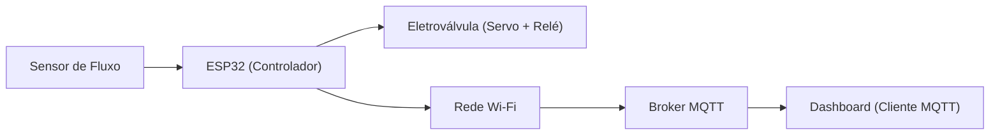
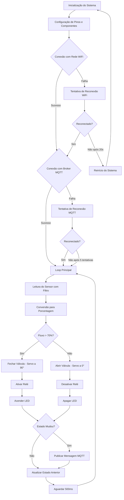

# AquaSmart: Sistema Inteligente de Monitoramento e Economia de Água


## Sobre o Projeto

O AquaSmart é um sistema IoT (Internet das Coisas) desenvolvido para monitoramento e controle inteligente do consumo de água, visando promover a economia e sustentabilidade dos recursos hídricos. Utilizando um microcontrolador ESP32, sensores de fluxo de água e atuadores, o sistema é capaz de detectar vazamentos, consumo excessivo e interromper automaticamente o fornecimento de água em situações críticas.

Este projeto está alinhado com o Objetivo de Desenvolvimento Sustentável 6 (ODS 6) da ONU, que visa garantir a disponibilidade e a gestão sustentável da água para todos.

## Funcionalidades

- **Monitoramento em tempo real** do fluxo de água
- **Detecção automática** de vazamentos e consumo anormal
- **Interrupção automática** do fornecimento em caso de anomalias
- **Comunicação via MQTT** para monitoramento remoto
- **Dashboard online** para visualização de dados e alertas
- **Sistema de notificação** para alertas críticos

## Arquitetura do Sistema

### Diagrama de Blocos




### Fluxograma de Funcionamento



## Hardware Utilizado

### Componentes Principais

1. **Microcontrolador ESP32**
   - Função: Unidade central de processamento e comunicação
   - Especificações: Dual-core 240 MHz, 520 KB SRAM, 4 MB Flash, 34 GPIOs
   - Responsável pelo processamento dos dados do sensor, controle dos atuadores e comunicação MQTT

2. **Sensor de Fluxo de Água** (simulado por potenciômetro na plataforma Wokwi)
   - Função: Medir a vazão de água no sistema
   - Especificações: Na implementação real, recomenda-se o sensor YF-S201 com capacidade de 1-30L/min
   - No protótipo simulado: Potenciômetro de 10kΩ gerando valores analógicos (0-4095)

3. **Servomotor SG90**
   - Função: Controlar mecanicamente a abertura/fechamento da válvula de água
   - Especificações: Torque de 1.8 kgf·cm, rotação de 0° a 180°
   - Posições: 0° (válvula aberta) e 90° (válvula fechada)

4. **Módulo Relé**
   - Função: Controle ON/OFF do circuito de água em cenários críticos
   - Especificações: 5V DC, 10A/250V AC
   - Estado: HIGH (ativado) quando fluxo > 70%, LOW (desativado) quando fluxo ≤ 70%

5. **LED Indicador**
   - Função: Indicação visual do estado do sistema
   - Estado: Aceso quando há alerta de fluxo alto, apagado em condições normais

### Esquema de Conexões

| Componente      | Pino ESP32 | Função                                |
|-----------------|------------|---------------------------------------|
| Potenciômetro   | 34         | Entrada analógica (simulando sensor)  |
| Servo Motor     | 18         | Saída PWM para controle da válvula    |
| Módulo Relé     | 26         | Saída digital para controle ON/OFF    |
| LED Indicador   | 27         | Saída digital para indicação visual   |

### Diagrama de Montagem

O sistema foi prototipado na plataforma Wokwi, com a seguinte configuração:

- ESP32 como unidade central
- Potenciômetro conectado ao pino 34 (simulando sensor de fluxo)
- Servo motor conectado ao pino 18 (simulando válvula)
- Relé conectado ao pino 26 (controle de circuito)
- LED conectado ao pino 27 (indicação visual)

## Software Desenvolvido

### Visão Geral do Código

O software do AquaSmart é estruturado em módulos funcionais:

1. **Inicialização e Configuração**
   - Definição de pinos e constantes
   - Configuração de componentes (servo, WiFi, MQTT)

2. **Aquisição e Processamento de Dados**
   - Leitura do sensor com filtro de média móvel
   - Conversão de valores brutos para percentual de fluxo

3. **Lógica de Controle**
   - Análise do fluxo de água
   - Tomada de decisão baseada em limites predefinidos (>70%)
   - Controle dos atuadores (servo e relé)

4. **Comunicação MQTT**
   - Conexão com broker MQTT
   - Publicação de alertas e status
   - Recepção de comandos remotos

5. **Gerenciamento de Falhas**
   - Reconexão automática WiFi e MQTT
   - Tratamento de timeouts e erros

### Principais Funções

#### Filtro de Média Móvel

```cpp
int lerSensorComFiltro() {
  totalLeituras -= leituras[indiceAtual];
  leituras[indiceAtual] = analogRead(POT_PIN);
  totalLeituras += leituras[indiceAtual];
  indiceAtual = (indiceAtual + 1) % AMOSTRAS;
  
  return totalLeituras / AMOSTRAS;
}
```

Esta função implementa um filtro de média móvel para suavizar as leituras do sensor, reduzindo ruídos e flutuações momentâneas.

#### Lógica de Controle

```cpp
// Lógica de controle da válvula
bool estadoAtual = (percent > 70);

if (estadoAtual) {  
  digitalWrite(RELAY_PIN, HIGH);  // Ativa o relé
  digitalWrite(LED_PIN, HIGH);    // Acende o LED
  valveServo.write(90);           // Fecha a válvula (servo)

  Serial.println("🚨 ALERTA: Fluxo alto! Fechando válvula...");
  
  // Publica apenas se o estado mudou
  if (estadoAtual != estadoAnterior) {
    String mensagem = "ALERTA: Fluxo alto (" + String(percent) + "%)! Válvula fechada!";
    mqttClient.publish(TOPIC_ALERTA, mensagem.c_str());
  }
} else {
  digitalWrite(RELAY_PIN, LOW);   // Desativa o relé
  digitalWrite(LED_PIN, LOW);     // Apaga o LED
  valveServo.write(0);            // Abre a válvula (servo)

  Serial.println("✅ Fluxo normal. Válvula aberta.");
  
  // Publica apenas se o estado mudou
  if (estadoAtual != estadoAnterior) {
    String mensagem = "Fluxo normal (" + String(percent) + "%). Válvula aberta.";
    mqttClient.publish(TOPIC_ALERTA, mensagem.c_str());
  }
}
```

Este trecho implementa a lógica principal de controle, determinando quando fechar a válvula e enviar alertas baseado no percentual de fluxo detectado.

#### Reconexão MQTT

```cpp
void reconnect() {
  int tentativas = 0;
  // Tenta reconectar ao MQTT até 5 vezes
  while (!mqttClient.connected() && tentativas < 5) {
    Serial.print("Conectando ao MQTT...");
    
    // Gera um ID de cliente único
    String clientId = MQTT_CLIENT_ID + String(random(0xffff), HEX);
    
    if (mqttClient.connect(clientId.c_str())) {
      Serial.println(" Conectado!");
      
      // Inscreve no tópico
      boolean subscribeSuccess = mqttClient.subscribe(TOPIC_ALERTA);
      Serial.print("Inscrição no tópico: ");
      Serial.println(subscribeSuccess ? "Sucesso" : "Falha");
      
      // Envia mensagem de status inicial
      mqttClient.publish(TOPIC_ALERTA, "Dispositivo online");
    } else {
      Serial.print(" Falha, rc=");
      Serial.print(mqttClient.state());
      Serial.println(" Tentando novamente em 5s...");
      tentativas++;
      delay(5000);  // Espera 5 segundos antes de tentar reconectar
    }
  }
}
```

Esta função gerencia a conexão com o broker MQTT, implementando tentativas de reconexão com backoff e geração de IDs de cliente únicos.

## Comunicação e Protocolos

### Protocolo MQTT

O sistema utiliza o protocolo MQTT (Message Queuing Telemetry Transport) para comunicação IoT, escolhido por suas vantagens:

- **Leve**: Ideal para dispositivos com recursos limitados
- **Eficiente**: Baixo consumo de banda e bateria
- **Confiável**: Suporte a diferentes níveis de QoS (Quality of Service)
- **Assíncrono**: Modelo publish/subscribe que desacopla produtores e consumidores

#### Configuração MQTT

- **Broker**: broker.emqx.io (público)
- **Porta**: 1883 (padrão, não criptografada)
- **Cliente ID**: Gerado dinamicamente para evitar conflitos
- **Tópico**: agua/alerta

#### Formato das Mensagens

O sistema publica mensagens nos seguintes formatos:

1. **Mensagem de Status Inicial**:
   ```
   "Dispositivo online"
   ```

2. **Alerta de Fluxo Alto**:
   ```
   "ALERTA: Fluxo alto (XX%)! Válvula fechada!"
   ```

3. **Notificação de Fluxo Normal**:
   ```
   "Fluxo normal (XX%). Válvula aberta."
   ```

### Comunicação WiFi

O ESP32 se conecta à rede WiFi para estabelecer comunicação com a internet:

- **Configuração**: SSID e senha definidos no código
- **Reconexão**: Automática em caso de perda de conexão
- **Timeout**: 20 segundos para estabelecer conexão inicial
- **Fallback**: Reinício do dispositivo após falhas persistentes

## Instalação e Configuração

### Requisitos de Hardware

- ESP32 (recomendado: ESP32 DevKit V1)
- Sensor de fluxo de água YF-S201 (ou similar)
- Servo motor SG90
- Módulo relé 5V
- LED indicador
- Resistores e cabos de conexão
- Fonte de alimentação 5V/2A

### Requisitos de Software

- Arduino IDE (versão 1.8.x ou superior)
- Bibliotecas:
  - Arduino.h
  - WiFi.h
  - PubSubClient.h
  - ESP32Servo.h

### Passos para Instalação

1. **Configuração do Ambiente**:
   - Instale a Arduino IDE
   - Adicione suporte ao ESP32 via Gerenciador de Placas
   - Instale as bibliotecas necessárias via Gerenciador de Bibliotecas

2. **Montagem do Hardware**:
   - Conecte os componentes conforme o diagrama de montagem
   - Verifique as conexões antes de energizar

3. **Configuração do Software**:
   - Clone este repositório
   - Abra o arquivo AquaSmart.cpp na Arduino IDE
   - Modifique as constantes `ssid` e `password` para sua rede WiFi
   - Opcionalmente, altere o broker MQTT para um servidor privado

4. **Upload do Código**:
   - Conecte o ESP32 via USB
   - Selecione a placa e porta corretas na Arduino IDE
   - Faça o upload do código

5. **Verificação**:
   - Abra o Monitor Serial (115200 baud)
   - Verifique se o dispositivo conecta ao WiFi e MQTT
   - Teste o funcionamento do sensor e atuadores

### Teste via Wokwi de forma online
   - Link Projeto: https://wokwi.com/projects/424710372910278657


### Teste com Cliente MQTT

Para monitorar as mensagens MQTT:

1. Instale um cliente MQTT como MQTT Explorer ou Mosquitto
2. Conecte ao broker broker.emqx.io na porta 1883
3. Inscreva-se no tópico "agua/alerta"
4. Observe as mensagens publicadas pelo dispositivo

## Testes e Resultados

### Tempo de Resposta

Medições realizadas em ambiente de teste:

| Medida | Sensor/Atuador | Tempo de Resposta (ms) |
|--------|---------------|------------------------|
| 1      | Sensor de Fluxo | 120 |
| 2      | Sensor de Fluxo | 115 |
| 3      | Sensor de Fluxo | 125 |
| 4      | Sensor de Fluxo | 118 |
| **Média** | **Sensor de Fluxo** | **119.5** |
| 1      | Servo (Válvula) | 210 |
| 2      | Servo (Válvula) | 205 |
| 3      | Servo (Válvula) | 215 |
| 4      | Servo (Válvula) | 208 |
| **Média** | **Servo (Válvula)** | **209.5** |
| 1      | Relé | 95 |
| 2      | Relé | 90 |
| 3      | Relé | 98 |
| 4      | Relé | 92 |
| **Média** | **Relé** | **93.75** |

### Consumo de Recursos

- **Memória Flash**: ~1.2MB (29% do ESP32)
- **RAM**: ~45KB (8.6% do ESP32)
- **Consumo de Energia**: ~120mA em operação normal

## Limitações e Melhorias Futuras

### Limitações Atuais

- Sistema atual não possui armazenamento de histórico local
- Não há autenticação na comunicação MQTT
- Calibração manual do sensor é necessária para diferentes tipos de tubulação

### Melhorias Planejadas

- Implementação de armazenamento local em cartão SD
- Adição de criptografia TLS para comunicação MQTT
- Desenvolvimento de aplicativo móvel dedicado
- Integração com assistentes de voz (Alexa, Google Assistant)
- Calibração automática baseada em machine learning

## Contribuições

Contribuições são bem-vindas! Para contribuir:

1. Faça um fork do repositório
2. Crie uma branch para sua feature (`git checkout -b feature/AmazingFeature`)
3. Commit suas mudanças (`git commit -m 'Add some AmazingFeature'`)
4. Push para a branch (`git push origin feature/AmazingFeature`)
5. Abra um Pull Request

## Licença

Este projeto está licenciado sob a licença MIT - veja o arquivo LICENSE para detalhes.

## Autores

- Murilo de Oliveira Silva - RA: 10414677
- Kedley Tofoli Mendonça - RA: 10415012
- Jefferson Araújo Silva - RA: 10414533

## Agradecimentos

- Universidade Presbiteriana Mackenzie
- Faculdade de Computação e Informática
- Professores e colegas que contribuíram com feedback
